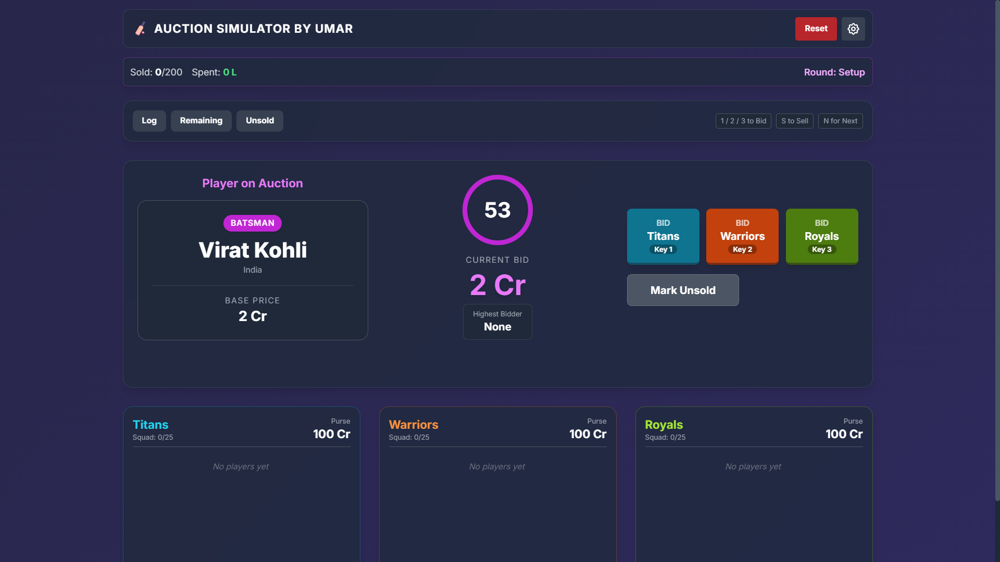
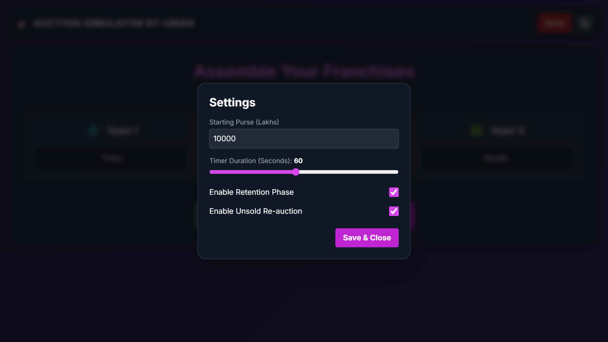
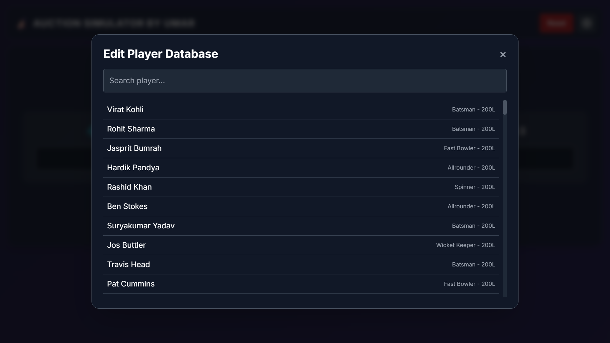

# <div align="center">🏏 Cricket Auction Simulator</div>

<div align="center">

### Experience the High-Stakes Thrill of a Professional T20 Auction

Build your dream squad • Outbid your rivals • Manage your purse • Dominate the auction

[](https://cricketauctionsimulator.netlify.app/)
[](https://github.com/umarmahtab/Cricket-Action-Simulator-V3.git)

**Report Bug • Request Feature**

</div>

---

> [!IMPORTANT]
>
> ## This is the latest version of Cricket Auction Simulator.
>
> Looking for the previous version?
>
> **Legacy Repository (V1):**
> https://github.com/umarmahtab/YOUR-OLD-REPOSITORY
>
> This version includes a redesigned interface, improved auction flow, enhanced performance, better team management, new customization options, and numerous quality-of-life improvements over the original release.

---

# 📖 About

Cricket Auction Simulator is a modern browser-based cricket auction simulator inspired by professional T20 league auctions.

The application recreates the excitement of a live player auction where you can strategically bid, manage franchise budgets, retain star players, and build balanced squads while competing against other teams.

Designed using **Vanilla JavaScript**, **HTML5**, **CSS3**, and **Tailwind CSS**, the simulator delivers a fast, responsive, and immersive experience directly in your browser without requiring any installation.

---

# ✨ Features

## 🏏 Auction Gameplay

* Live player bidding system
* Real-time countdown timer
* Intelligent bid increment logic
* Three-franchise auction support
* Player retention phase
* Automatic purse deduction
* Unsold player re-auction
* Live auction logs
* Smart winner detection

---

## 👥 Team Management

* Team squad overview
* Remaining purse tracker
* Category-wise player lists
* Sold player history
* Team statistics
* Auction summary

---

## ⚙️ Customization

* Adjustable auction timer
* Custom starting purse
* Toggle retention phase
* Built-in player database editor
* Easy auction configuration

---

## 📊 Analytics

* Sticky statistics bar
* Total money spent
* Players sold
* Remaining players
* Live auction progress
* Team-wise statistics

---

## 💾 Data Management

* Automatic Local Storage save
* Resume previous auction
* Persistent settings
* Continue where you left off

---

# 🚀 Version 2 (Currently in Development)

The next major update is currently under active development and testing.

### Planned Features

* 🌐 Online Multiplayer Auctions
* 🎨 Multiple UI Themes
* 📄 Export Auction as PDF
* 📊 Export Auction as Excel
* 📁 Save & Load Auctions (JSON)
* ☁️ Cloud Save Support
* 📱 Better Mobile Experience
* 🎭 Improved Animations
* 🔊 Enhanced Sound Effects
* ⚡ Performance Optimizations

---

# 📸 Screenshots

<table>
<tr>
<td></td>
<td></td>
</tr>

<tr>
<td></td>
<td></td>
</tr>

<tr>
<td></td>
<td></td>
</tr>

<tr>
<td></td>
<td></td>
</tr>
</table>

---

# ⌨️ Keyboard Shortcuts

| Key   | Action              |
| ----- | ------------------- |
| **1** | Bid for Team 1      |
| **2** | Bid for Team 2      |
| **3** | Bid for Team 3      |
| **N** | Next Player         |
| **S** | Sell Current Player |

---

# 🚀 Getting Started

### Clone the Repository

```bash
git clone https://github.com/umarmahtab/cricket-auction-simulator.git
```

### Open the Project

```bash
cd cricket-auction-simulator
```

Simply open:

```text
index.html
```

using any modern browser.

No installation, package managers, or build tools are required.

---

# 🔊 Optional Sound Effects

Create a folder named:

```text
sounds/
```

and add:

```text
bid.wav
sold.wav
unsold.wav
tension.wav
crowd-loop.mp3
```

The simulator works perfectly without these files, but adding them creates a much more immersive auction atmosphere.

---

# 🛠️ Built With

* HTML5
* CSS3
* Vanilla JavaScript (ES6)
* Tailwind CSS
* Local Storage API

---

# 🗺️ Roadmap

* ✅ Real-Time Auction Engine
* ✅ Three-Team Auction System
* ✅ Player Retention
* ✅ Auction Logs
* ✅ Local Save System
* ✅ Player Database Editor
* ⏳ Online Multiplayer
* ⏳ PDF Export
* ⏳ Excel Export
* ⏳ JSON Save & Load
* ⏳ Multiple Themes
* ⏳ Cloud Save
* ⏳ Team Logos
* ⏳ Mobile Optimizations

---

# 🤝 Contributing

Contributions, feature requests, ideas, and bug reports are always welcome.

If you'd like to contribute:

1. Fork the repository
2. Create your feature branch

```bash
git checkout -b feature/AmazingFeature
```

3. Commit your changes

```bash
git commit -m "Add AmazingFeature"
```

4. Push to your branch

```bash
git push origin feature/AmazingFeature
```

5. Open a Pull Request

---

# 📄 Disclaimer

This project is an independent fan-made cricket auction simulator created for educational and entertainment purposes.

It is **not affiliated with, endorsed by, or associated with the IPL, BCCI, or any official cricket organization**. Team names, player names, and auction mechanics are used solely to simulate a realistic auction experience.

---

# 👨‍💻 Author

**Umar Mahtab**

GitHub: https://github.com/umarmahtab

---

<div align="center">

### ⭐ If you enjoyed this project, consider giving it a Star!

Made with ❤️ by **Umar Mahtab**

</div>
